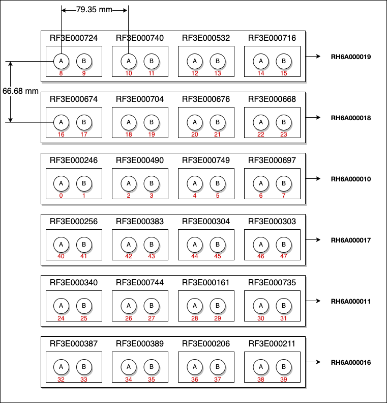

# mMIMO DoA Source Code

This repository contains Python and Matlab portions of the source code for the paper [**Single-Sample Direction-of-Arrival Estimation for Fast and Robust 3D Localization with Real Measurements from a Massive MIMO System**](./assets/manuscript.pdf).

The paper has been submitted and accepted at [IEEE ICASSP 2023](https://2023.ieeeicassp.org/).

## Authors:
* [Stepan Mazokha](smazokha2016@fau.edu)
* [Sanaz Naderi](snaderi2021@fau.edu)
* [Georgios I. Orfanidis](gorfanidis2021@fau.edu)
* [George Sklivanitis](gsklivanitis@fau.edu)

## Links:

* FAU CA-AI: [link](https://www.fau.edu/engineering/research/c2a2/)
* FAU I-SENSE: [link](https://www.fau.edu/isense/)
* POWDER MIMO Dataset: [link](https://renew-wireless.org/dataset-aoa.html)
* POWDER MIMO Repository: [link](https://gitlab.flux.utah.edu/cnn-signal-discovery-senior-project/signal-collection)
* Ground Truth DoA Calculations: [link](https://docs.google.com/spreadsheets/d/1pu0bsN7wVaiehZxpgMJO2_AD-s3ZCJVnLLbtSgUTGf8/edit?usp=sharing)

## POWDER MIMO Dataset

The dataset has been collected by a Massive MIMO receiver from two devices: a reference emitter (always positioned at 0 degrees) and a client emitter (changing its location across different azimuth and elevation angles).

You can review the Massive MIMO receiever diagram in the figure below.

The receiver has 6 rows of antennas and 8 columns of antennas. However, since not all columns are equidistant, we use only "A" or "B" antennas separately. 

The distances between antennas (both row and column-wise) are provided on the figure.

The dataset can be downloaded using the following [link](https://renew-wireless.org/dataset-aoa.html).

The spreadsheet where we calculated ground truth DoA angles of the real dataset (based on TX & RX coordinates) can be found [here](https://docs.google.com/spreadsheets/d/1pu0bsN7wVaiehZxpgMJO2_AD-s3ZCJVnLLbtSgUTGf8/edit?usp=sharing).

A note about raw dataset measurements:

    In raw format, each frame contains 4096 samples. These are IQ values, but stored in a non-complex format. They are stored like this: [IQIQIQIQIQIQIQIQ...]

    To convert them, we must run the following code:

    # Retrieve the frame
    frame = pilot_samples[...]

    # Extract 'I' samples (at even indexes), and divide by 2**15
    I = pilot_samples[..., 0:samps_per_slot * 2:2] / 2 ** 15

    # Extract 'Q' samples (at odd indexes), and divide by 2**15
    Q = pilot_samples[..., 1:samps_per_slot * 2:2] / 2 ** 15

    # Compose IQ sample values as complex numbers
    IQ = np.array(I + (Q * 1j), dtype=np.complex64)

## How to reproduce the paper results?

In order to reproduce the results presented in the paper, one has to go through the following tasks:

*Note*: steps 1-3 are optional and are only necessary if you would like to re-generate the dataset from scratch. We provide an already pre-processed dataset that is ready for step 4 in the [`data`](./data/) folder of this repository.

1. Download the [dataset](https://renew-wireless.org/dataset-aoa.html) and clone this repository;

    For our experiments, we used the following dataset files:

    * run1x1/trace-uplink-2021-12-3-16-28-51_1x48x2_0_47.hdf5
    * run2x1/trace-uplink-2021-12-3-17-43-58_1x48x2_0_47.hdf5
    * run3x1/trace-uplink-2021-12-3-19-17-46_1x48x2_0_47.hdf5
    * run4x1/trace-uplink-2021-12-3-20-41-34_1x48x2_0_47.hdf5
    * run5x1/trace-uplink-2021-12-4-9-13-36_1x48x2_0_47.hdf5
    * run6x1/trace-uplink-2021-12-4-10-32-35_1x48x2_0_47.hdf5
    * run7x1/trace-uplink-2021-12-4-11-38-27_1x48x2_0_47.hdf5
    * run8x1/trace-uplink-2021-12-4-12-49-47_1x48x2_0_47.hdf5
    
    For this tutorial, we will assume that the files will be stored in a directory `~/mmimo_dataset/`.

    Make sure that you follow the directory structure from the dataset repository (i.e., each file must be in a corresponding folder `runAxB`).

2. Parse the dataset;

    Parsing of the dataset you just downloaded is performed by the Python part of this repository. To perform parsing, perform the following steps:

    1. Install `scipy`, `numpy` and `h5py`;
    2. In [`parser.py`](./src/python/parser/parser.py), modify the variable `DIR_SOURCE` to match the location of the dataset you just downloaded (for our example, it's `~/mmimo_dataset/`);
    3. Run the script: `python3 parser.py`
    4. In the folder [`data`](./data/), you should see 8 new files: `run1x1.mat`, `run2x1.mat`, ..., `run8x1.mat`.

3. Perform measurement calibration;

    To perform calibration, perform the following steps:

    1. Follow tasks from step 2 (keep all files in `data` folder);
    2. Launch 4 calibration scripts in this order:
        * [`iao_calculator_cols.m`](./src/matlab/data_prep/iao_calculator_cols.m)
        * [`iao_calculator_rows.m`](./src/matlab/data_prep/iao_calculator_rows.m)
        * [`dataset_generator_elev.m`](./src/matlab/data_prep/dataset_generator_elev.m)
        * [`dataset_generator_az.m`](./src/matlab/data_prep/dataset_generator_az.m)
    3. These scripts will result in final pre-processed dataset that is ready for MUSIC and Hankel SVD evaluation in the `data` folder: `client_x1_for_az.mat`, `client_x1_for_elev.mat`, etc.

4. Perform evaluation of both MUSIC and Hankel SVD methods.

    To perform MUSIC and Hankel SVD evaluation, simply launch the script [`tests.py`](./src/matlab/evaluation/tests.m) without any modifications.

---

This research is supported in part by the ERC for Smart Street Scapes, funded through NSF award EEC-2133516 and in part by NSF awards EECS-2030234, CNS-2117822, CNS-1753406, and ITE-2226392. 

We would also like to acknowledge POWDER-RENEW personnel Dr. Oscar Bejarano and collaborators from the Technical University of Crete, Greece, Prof. George Karystinos, and Mr. Ioannis Grypiotis for their help on data calibration.
